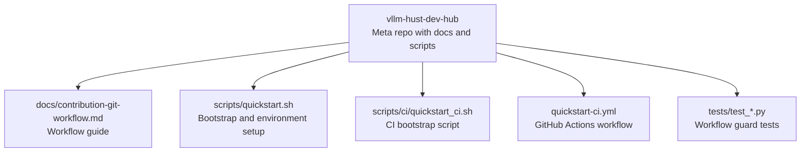
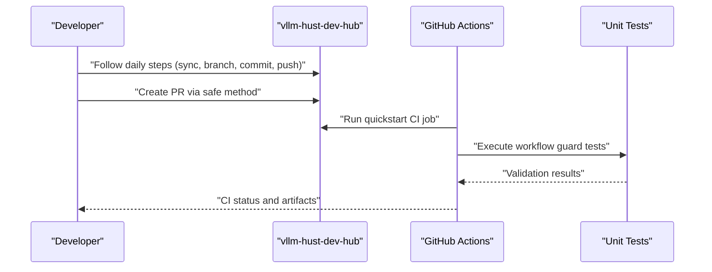
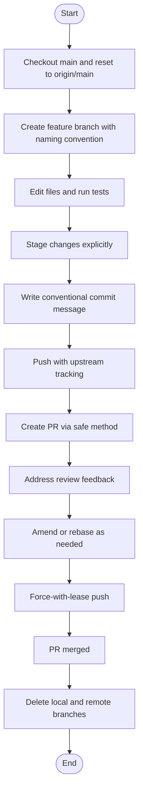
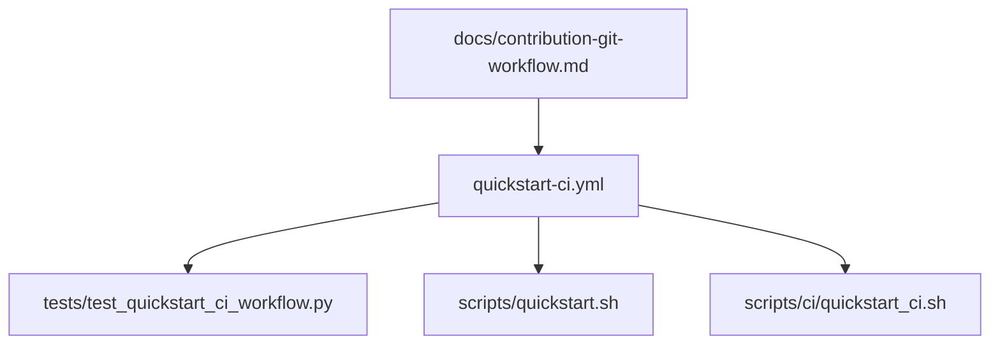

# Git Workflow

<cite>
**Referenced Files in This Document**
- [contribution-git-workflow.md](file://docs/contribution-git-workflow.md)
- [.gitignore](file://.gitignore)
- [quickstart.sh](file://scripts/quickstart.sh)
- [quickstart-ci.yml](file://.github/workflows/quickstart-ci.yml)
- [test_quickstart_ci_workflow.py](file://tests/test_quickstart_ci_workflow.py)
- [README.md](file://README.md)
</cite>

## Table of Contents
1. [Introduction](#introduction)
2. [Project Structure](#project-structure)
3. [Core Components](#core-components)
4. [Architecture Overview](#architecture-overview)
5. [Detailed Component Analysis](#detailed-component-analysis)
6. [Dependency Analysis](#dependency-analysis)
7. [Performance Considerations](#performance-considerations)
8. [Troubleshooting Guide](#troubleshooting-guide)
9. [Conclusion](#conclusion)

## Introduction
This document defines the Git workflow for the VLLM-HUST Development Hub. It consolidates the daily development process, branch naming, commit standards, PR creation, and cleanup procedures. It also documents recommended Git configurations (global and repository-specific), best practices for keeping the working tree clean, and practical troubleshooting guidance for common issues such as accidental commits to main, merge conflicts, and untracked files.

## Project Structure
The repository is a meta-repository that orchestrates development across multiple related repositories. The Git workflow documentation and supporting scripts live here, while the actual development happens in sibling repositories (e.g., vllm-hust). The workflow emphasizes a clean, linear history via rebase and disciplined branch hygiene.

**Diagram sources**
- [README.md:15-50](file://README.md#L15-L50)
- [contribution-git-workflow.md:1-20](file://docs/contribution-git-workflow.md#L1-L20)
- [quickstart.sh:1-20](file://scripts/quickstart.sh#L1-L20)
- [quickstart-ci.yml:1-20](file://.github/workflows/quickstart-ci.yml#L1-L20)
- [test_quickstart_ci_workflow.py:1-20](file://tests/test_quickstart_ci_workflow.py#L1-L20)

**Section sources**
- [README.md:15-50](file://README.md#L15-L50)
- [contribution-git-workflow.md:1-20](file://docs/contribution-git-workflow.md#L1-L20)

## Core Components
- Daily development workflow: a step-by-step process for syncing main, branching, committing, pushing, creating PRs, responding to reviews, and cleaning up.
- Branch naming convention: structured names including GitHub ID, type, short description, and date.
- Commit message standards: conventional type, summary, body explaining what and why, optional Co-authored-by, Signed-off-by for DCO.
- PR safety: explicit URLs and GitHub CLI guidance to prevent targeting the wrong upstream repository.
- Clean working tree rules: never develop on main, handle WIP with commits or stashes, avoid git add ., and regularly prune merged branches.
- Rebase-first policy: prefer rebasing over merge commits to maintain a clean history.

**Section sources**
- [contribution-git-workflow.md:135-300](file://docs/contribution-git-workflow.md#L135-L300)
- [contribution-git-workflow.md:110-132](file://docs/contribution-git-workflow.md#L110-L132)
- [contribution-git-workflow.md:184-190](file://docs/contribution-git-workflow.md#L184-L190)
- [contribution-git-workflow.md:304-371](file://docs/contribution-git-workflow.md#L304-L371)
- [contribution-git-workflow.md:226-300](file://docs/contribution-git-workflow.md#L226-L300)

## Architecture Overview
The workflow integrates developer actions with CI to ensure consistency and reliability. The CI workflow validates the quickstart bootstrap and environment setup, ensuring the documented workflow remains functional.

**Diagram sources**
- [quickstart-ci.yml:1-72](file://.github/workflows/quickstart-ci.yml#L1-L72)
- [test_quickstart_ci_workflow.py:28-96](file://tests/test_quickstart_ci_workflow.py#L28-L96)

**Section sources**
- [quickstart-ci.yml:1-72](file://.github/workflows/quickstart-ci.yml#L1-L72)
- [test_quickstart_ci_workflow.py:28-96](file://tests/test_quickstart_ci_workflow.py#L28-L96)

## Detailed Component Analysis

### Daily Development Workflow
The workflow is a repeatable routine designed to minimize friction and risk:
- Sync main: fetch and hard reset main to origin/main to ensure a clean baseline.
- Create feature branch: derive from the latest main with a descriptive branch name.
- Develop and commit: stage files explicitly, write conventional commit messages, and sign off.
- Push and PR: push with upstream tracking, then create a PR using a safe method.
- Respond to reviews: amend or rebase as needed, then force-with-lease push.
- Cleanup: delete merged branches locally and remotely.

**Diagram sources**
- [contribution-git-workflow.md:137-220](file://docs/contribution-git-workflow.md#L137-L220)
- [contribution-git-workflow.md:374-394](file://docs/contribution-git-workflow.md#L374-L394)

**Section sources**
- [contribution-git-workflow.md:137-220](file://docs/contribution-git-workflow.md#L137-L220)
- [contribution-git-workflow.md:374-394](file://docs/contribution-git-workflow.md#L374-L394)

### Branch Naming Convention
Branches are named to avoid collisions and clearly identify ownership and intent:
- Pattern: <github-id>/<type>-<short-desc>-<YYYYMMDD>
- Types include fix, feat, hotfix, refactor, docs, bench, ci.
- Date suffix prevents collisions when multiple tasks are developed concurrently.

**Section sources**
- [contribution-git-workflow.md:110-132](file://docs/contribution-git-workflow.md#L110-L132)

### Commit Message Standards
- Type + Short summary (conventional).
- Blank line separator.
- Body explaining what and why (not how).
- Optional Co-authored-by for AI assistance.
- Signed-off-by for Developer Certificate of Origin.

**Section sources**
- [contribution-git-workflow.md:184-190](file://docs/contribution-git-workflow.md#L184-L190)

### PR Creation Safety
Two safe methods are documented:
- GitHub URL template: construct a direct compare URL pointing to the intended organization repository.
- GitHub CLI: specify repo, base, head, title, and body explicitly.

Additionally, avoid shortlinks that may target the upstream repository instead of the organization repository.

**Section sources**
- [contribution-git-workflow.md:306-351](file://docs/contribution-git-workflow.md#L306-L351)

### Maintaining a Clean Working Tree
Key rules:
- Never develop directly on main; always reset main to origin/main before branching.
- Before switching branches, handle uncommitted changes via commit, stash, or discard.
- Verify cleanliness after switching and confirm you are on the intended commit.
- Avoid git add . or git add -A; stage files explicitly.
- Periodically prune merged local branches and remote-tracking branches.

**Section sources**
- [contribution-git-workflow.md:226-300](file://docs/contribution-git-workflow.md#L226-L300)

### Recommended Git Configurations
Repository-level (preferred) settings:
- pull.rebase=true: rebase on pull to avoid merge commits.
- branch.autoSetupMerge=true: automatically set up tracking for new branches.
- fetch.prune=true: prune deleted remote branches on fetch.
- push.default=current: push only the current branch by default.

Identity:
- Configure user.name and user.email per repository.

Verification:
- Confirm remotes and key config values.

**Section sources**
- [contribution-git-workflow.md:66-106](file://docs/contribution-git-workflow.md#L66-L106)

### Conflict Resolution and Rebase Strategy
When conflicts arise:
- Fetch origin and rebase your branch onto origin/main.
- Resolve conflicts, stage the resolved files, and continue the rebase.
- Force-with-lease push to update the PR branch.

**Section sources**
- [contribution-git-workflow.md:413-426](file://docs/contribution-git-workflow.md#L413-L426)

### Practical Examples (Command Paths)
Below are the exact locations of common operations. Replace placeholders with your values and follow the steps in order.

- Sync main and reset:
  - [contribution-git-workflow.md:137-151](file://docs/contribution-git-workflow.md#L137-L151)
- Create feature branch:
  - [contribution-git-workflow.md:155-160](file://docs/contribution-git-workflow.md#L155-L160)
- Stage and commit:
  - [contribution-git-workflow.md:162-182](file://docs/contribution-git-workflow.md#L162-L182)
- Push with upstream:
  - [contribution-git-workflow.md:191-199](file://docs/contribution-git-workflow.md#L191-L199)
- Create PR safely:
  - [contribution-git-workflow.md:306-351](file://docs/contribution-git-workflow.md#L306-L351)
- Respond to review and rebase:
  - [contribution-git-workflow.md:205-220](file://docs/contribution-git-workflow.md#L205-L220)
- Clean up after merge:
  - [contribution-git-workflow.md:374-394](file://docs/contribution-git-workflow.md#L374-L394)
- Keep working tree clean:
  - [contribution-git-workflow.md:226-300](file://docs/contribution-git-workflow.md#L226-L300)

## Dependency Analysis
The workflow depends on:
- Consistent repository structure and remote configuration.
- CI jobs validating the bootstrap and environment setup.
- Unit tests guarding the CI workflow to prevent regressions.

**Diagram sources**
- [contribution-git-workflow.md:1-20](file://docs/contribution-git-workflow.md#L1-L20)
- [quickstart-ci.yml:1-72](file://.github/workflows/quickstart-ci.yml#L1-L72)
- [test_quickstart_ci_workflow.py:28-96](file://tests/test_quickstart_ci_workflow.py#L28-L96)
- [quickstart.sh:1-20](file://scripts/quickstart.sh#L1-L20)

**Section sources**
- [quickstart-ci.yml:1-72](file://.github/workflows/quickstart-ci.yml#L1-L72)
- [test_quickstart_ci_workflow.py:28-96](file://tests/test_quickstart_ci_workflow.py#L28-L96)

## Performance Considerations
- Rebase over merges: reduces merge commits and keeps history linear, simplifying bisect and review.
- Explicit staging: avoids accidentally including unrelated changes, reducing wasted CI cycles.
- Pruning: keeps local and remote references tidy, preventing confusion and reducing disk usage.

[No sources needed since this section provides general guidance]

## Troubleshooting Guide
Common scenarios and resolutions:
- Accidentally committed to main:
  - If not pushed: save commits to a temporary branch and reset main.
  - If already pushed: create a rescue branch and coordinate with maintainers to revert problematic commits.
  - Reference: [contribution-git-workflow.md:400-411](file://docs/contribution-git-workflow.md#L400-L411)
- Branch conflicts with main:
  - Rebase onto origin/main, resolve conflicts, continue rebase, and force-with-lease push.
  - Reference: [contribution-git-workflow.md:413-426](file://docs/contribution-git-workflow.md#L413-L426)
- Continuing work on an existing branch:
  - Either continue on the same branch or create a new branch from the latest main depending on task independence.
  - Reference: [contribution-git-workflow.md:428-439](file://docs/contribution-git-workflow.md#L428-L439)
- Untracked files:
  - Use clean with caution; prefer gitignore entries for build artifacts.
  - Reference: [contribution-git-workflow.md:441-451](file://docs/contribution-git-workflow.md#L441-L451)
- Verifying PR target:
  - Check PR page and use gh pr view to confirm base and head.
  - Reference: [contribution-git-workflow.md:453-462](file://docs/contribution-git-workflow.md#L453-L462)

**Section sources**
- [contribution-git-workflow.md:398-462](file://docs/contribution-git-workflow.md#L398-L462)

## Conclusion
The documented Git workflow for the VLLM-HUST Development Hub emphasizes safety, clarity, and maintainability. By following the daily steps, naming branches consistently, writing conventional commit messages, and using rebase to preserve a clean history, contributors can collaborate effectively. The included best practices and troubleshooting guidance further reduce risk and streamline development.