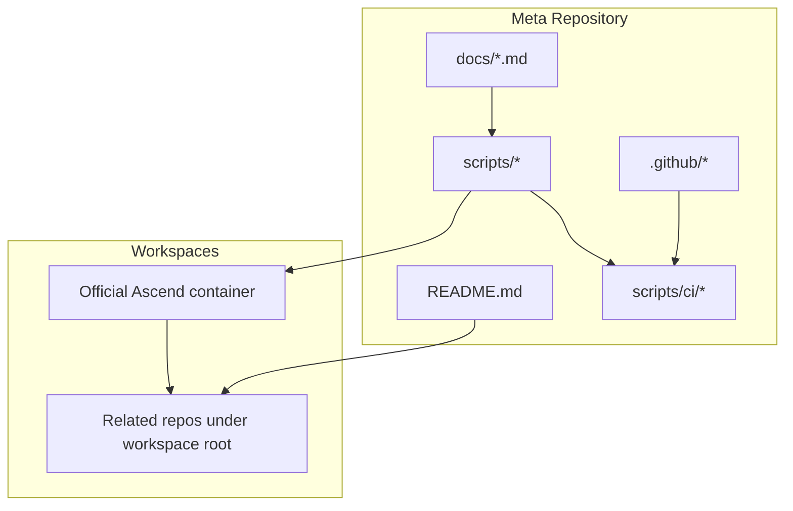
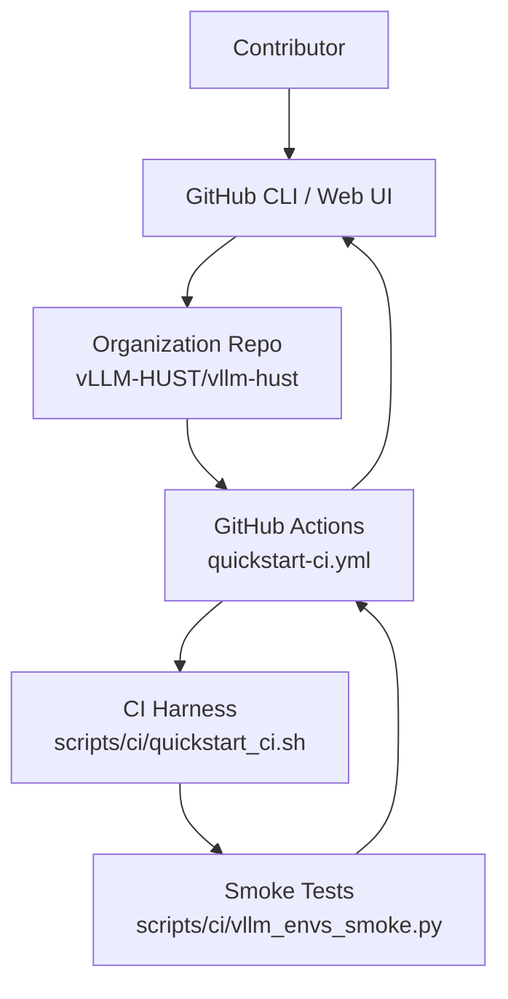
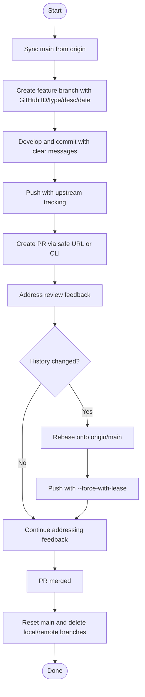
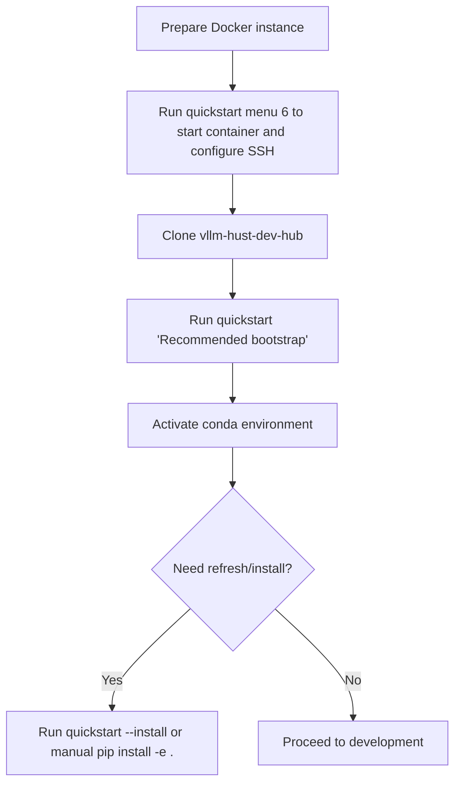
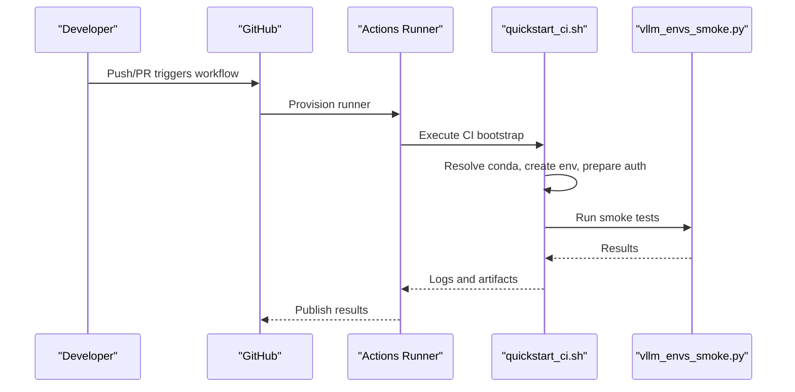
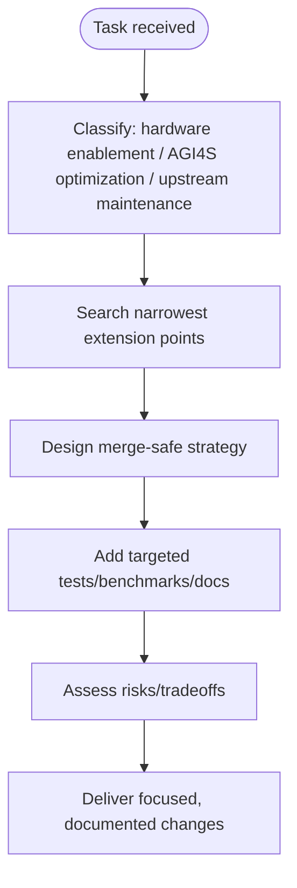
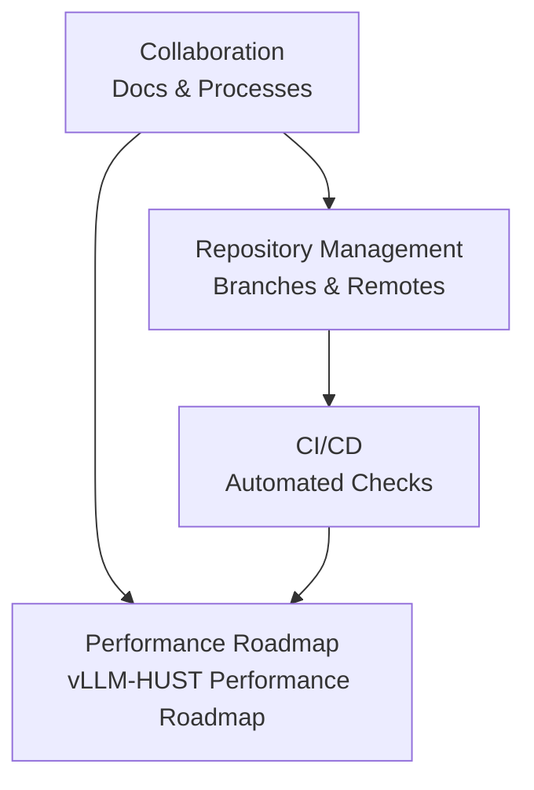
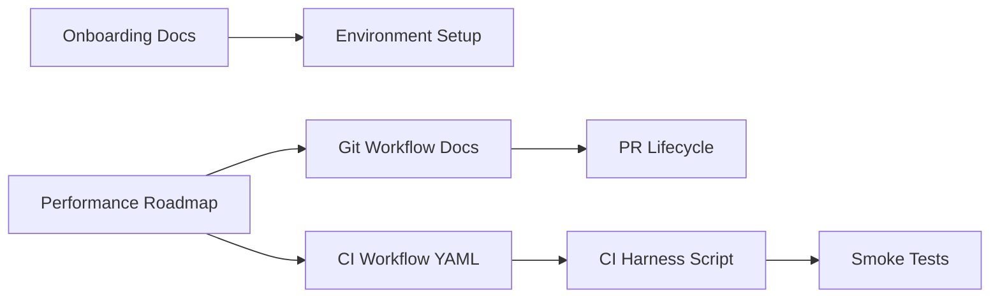

# Team Collaboration

<cite>
**Referenced Files in This Document**
- [README.md](file://README.md)
- [ROADMAP.md](file://ROADMAP.md)
- [docs/contribution-git-workflow.md](file://docs/contribution-git-workflow.md)
- [docs/team-onboarding.md](file://docs/team-onboarding.md)
- [.github/workflows/quickstart-ci.yml](file://.github/workflows/quickstart-ci.yml)
- [scripts/ci/quickstart_ci.sh](file://scripts/ci/quickstart_ci.sh)
- [scripts/ci/vllm_envs_smoke.py](file://scripts/ci/vllm_envs_smoke.py)
- [.github/agents/vllm-hust-localization.agent.md](file://.github/agents/vllm-hust-localization.agent.md)
- [.github/instructions/vllm-hust-localization.instructions.md](file://.github/instructions/vllm-hust-localization.instructions.md)
</cite>

## Table of Contents
1. [Introduction](#introduction)
2. [Project Structure](#project-structure)
3. [Core Components](#core-components)
4. [Architecture Overview](#architecture-overview)
5. [Detailed Component Analysis](#detailed-component-analysis)
6. [Dependency Analysis](#dependency-analysis)
7. [Performance Considerations](#performance-considerations)
8. [Troubleshooting Guide](#troubleshooting-guide)
9. [Conclusion](#conclusion)
10. [Appendices](#appendices)

## Introduction
This document describes team collaboration practices for the VLLM-HUST Development Hub. It consolidates contribution guidelines, Git workflow, code review processes, documentation standards, and onboarding procedures. It also explains how repository management and development workflows interlock with CI/CD automation and collaboration tools. The goal is to make collaboration predictable, efficient, and accessible to both new and experienced contributors.

## Project Structure
The Development Hub is a meta repository that coordinates a multi-repo workspace and provides scripts for bootstrapping environments, containerized development, and CI verification. Key areas:
- Meta repository and workspace: README outlines included repositories, scripts, and usage.
- Contribution and onboarding docs: standardized processes for Git workflow and developer onboarding.
- CI/CD: GitHub Actions workflows and CI harness scripts validate environment bootstrap and basic runtime checks.
- Agents and instructions: guidance for localization-focused changes that preserve upstream mergeability.

**Diagram sources**
- [README.md:15-32](file://README.md#L15-L32)
- [docs/contribution-git-workflow.md:1-20](file://docs/contribution-git-workflow.md#L1-L20)
- [docs/team-onboarding.md:1-20](file://docs/team-onboarding.md#L1-L20)
- [.github/workflows/quickstart-ci.yml:1-20](file://.github/workflows/quickstart-ci.yml#L1-L20)

**Section sources**
- [README.md:15-32](file://README.md#L15-L32)
- [docs/contribution-git-workflow.md:1-20](file://docs/contribution-git-workflow.md#L1-L20)
- [docs/team-onboarding.md:1-20](file://docs/team-onboarding.md#L1-L20)

## Core Components
- Contribution and Git workflow: defines branching, PR creation, review, and post-merge cleanup.
- Onboarding and environment setup: end-to-end process for containerized development and conda environment preparation.
- CI/CD pipeline: automated validation of bootstrap and smoke tests across runners.
- Localization guidance: agent and instruction documents for merge-safe, platform-specific changes.

**Section sources**
- [docs/contribution-git-workflow.md:23-47](file://docs/contribution-git-workflow.md#L23-L47)
- [docs/team-onboarding.md:11-24](file://docs/team-onboarding.md#L11-L24)
- [.github/workflows/quickstart-ci.yml:13-72](file://.github/workflows/quickstart-ci.yml#L13-L72)
- [.github/agents/vllm-hust-localization.agent.md:14-27](file://.github/agents/vllm-hust-localization.agent.md#L14-L27)

## Architecture Overview
The collaboration architecture connects contributor workflows (Git, PRs, reviews) with repository management (branches, remotes) and CI/CD automation (GitHub Actions jobs). It also integrates localization guidance to ensure changes remain upstream-friendly.

**Diagram sources**
- [.github/workflows/quickstart-ci.yml:13-72](file://.github/workflows/quickstart-ci.yml#L13-L72)
- [scripts/ci/quickstart_ci.sh:232-321](file://scripts/ci/quickstart_ci.sh#L232-L321)
- [scripts/ci/vllm_envs_smoke.py:1-69](file://scripts/ci/vllm_envs_smoke.py#L1-L69)

## Detailed Component Analysis

### Git Workflow and Contribution Guidelines
This component defines the “Fork Branch, no-Fork Repo” collaboration model, branch naming, and step-by-step development and PR lifecycle.

- Core principles:
  - main is for syncing only; never develop directly on main.
  - One task per branch; include GitHub ID, type, short description, and date.
  - All changes through PR; no direct pushes to main.
- Environment setup:
  - Use the hub’s quickstart to clone repos, configure remotes, and set up the conda environment.
  - Configure repository-level git settings for safer pulls, pruning, and upstream tracking.
- Daily development steps:
  - Sync main, create a feature branch, develop and commit with clear messages, push with upstream tracking, create a PR using a safe URL template or CLI, respond to reviews by amending or rebasing, and push with force-with-lease when history changes.
- Post-merge cleanup:
  - Reset main, delete merged local and remote branches, and verify status.
- Safety and hygiene:
  - Prevent dirty worktrees; avoid global add; clean up merged branches regularly.
- Common issues:
  - Accidentally committing to main: save commits to a temporary branch and reset main; if already pushed, coordinate a force-push with maintainers.
  - Merge conflicts: rebase onto origin/main, resolve, add, continue, and force-with-lease push.
  - PR safety: use explicit URLs or CLI to ensure PR targets the organization repo.

**Diagram sources**
- [docs/contribution-git-workflow.md:137-223](file://docs/contribution-git-workflow.md#L137-L223)
- [docs/contribution-git-workflow.md:374-394](file://docs/contribution-git-workflow.md#L374-L394)

**Section sources**
- [docs/contribution-git-workflow.md:23-47](file://docs/contribution-git-workflow.md#L23-L47)
- [docs/contribution-git-workflow.md:66-106](file://docs/contribution-git-workflow.md#L66-L106)
- [docs/contribution-git-workflow.md:110-132](file://docs/contribution-git-workflow.md#L110-L132)
- [docs/contribution-git-workflow.md:135-223](file://docs/contribution-git-workflow.md#L135-L223)
- [docs/contribution-git-workflow.md:226-300](file://docs/contribution-git-workflow.md#L226-L300)
- [docs/contribution-git-workflow.md:304-371](file://docs/contribution-git-workflow.md#L304-L371)
- [docs/contribution-git-workflow.md:374-394](file://docs/contribution-git-workflow.md#L374-L394)
- [docs/contribution-git-workflow.md:398-462](file://docs/contribution-git-workflow.md#L398-L462)

### Team Onboarding Procedures
This component documents the recommended end-to-end onboarding flow for containerized development and environment setup.

- Recommended flow:
  - Prepare or create the official Ascend Docker instance.
  - Use quickstart menu 6 to start the container, auto-configure SSH, and align container user with workspace ownership.
  - Clone the hub, run quickstart’s “Recommended bootstrap,” and activate the conda environment.
  - Refresh or reinstall only when necessary.
- SSH connectivity:
  - Prefer ProxyJump-based aliases to connect directly to the container via the host.
  - Clear cached host keys if the container was rebuilt.
- Environment specifics:
  - The hub automates cloning related repos, preparing Miniconda, creating the environment, installing core editable packages, and aligning Python stacks on Ascend systems.
  - Upstream reference repos are cloned under reference-repos for comparison and are not installed into the environment.
- Non-interactive usage:
  - Use flags to automate cloning, conda setup, and installation.
- Optional workstation:
  - vllm-hust-workstation requires its own .env configuration and is not part of the default environment.

**Diagram sources**
- [docs/team-onboarding.md:13-24](file://docs/team-onboarding.md#L13-L24)
- [docs/team-onboarding.md:34-64](file://docs/team-onboarding.md#L34-L64)
- [docs/team-onboarding.md:170-220](file://docs/team-onboarding.md#L170-L220)
- [docs/team-onboarding.md:238-298](file://docs/team-onboarding.md#L238-L298)

**Section sources**
- [docs/team-onboarding.md:11-24](file://docs/team-onboarding.md#L11-L24)
- [docs/team-onboarding.md:25-100](file://docs/team-onboarding.md#L25-L100)
- [docs/team-onboarding.md:108-153](file://docs/team-onboarding.md#L108-L153)
- [docs/team-onboarding.md:170-220](file://docs/team-onboarding.md#L170-L220)
- [docs/team-onboarding.md:223-300](file://docs/team-onboarding.md#L223-L300)
- [docs/team-onboarding.md:336-384](file://docs/team-onboarding.md#L336-L384)

### CI/CD and Automation
This component covers the automated validation of the development environment and basic runtime checks.

- Trigger conditions:
  - Runs on push to main, pull requests, and manual dispatch.
- Jobs:
  - Ubuntu runner: validates quickstart contract, ensures conda availability, runs CI bootstrap and tests, and uploads artifacts.
  - Self-hosted runner: similar flow with SSH-based authentication for private repos and extended install scope.
- CI harness:
  - Resolves conda, creates a scoped environment, prepares clone authentication, runs smoke tests, and validates runtime checks.
  - Writes structured results and logs for traceability.
- Smoke tests:
  - Validates environment import and port parsing behavior deterministically.

**Diagram sources**
- [.github/workflows/quickstart-ci.yml:13-72](file://.github/workflows/quickstart-ci.yml#L13-L72)
- [scripts/ci/quickstart_ci.sh:232-321](file://scripts/ci/quickstart_ci.sh#L232-L321)
- [scripts/ci/vllm_envs_smoke.py:1-69](file://scripts/ci/vllm_envs_smoke.py#L1-L69)

**Section sources**
- [.github/workflows/quickstart-ci.yml:1-72](file://.github/workflows/quickstart-ci.yml#L1-L72)
- [.github/workflows/quickstart-ci.yml:73-149](file://.github/workflows/quickstart-ci.yml#L73-L149)
- [scripts/ci/quickstart_ci.sh:47-99](file://scripts/ci/quickstart_ci.sh#L47-L99)
- [scripts/ci/quickstart_ci.sh:161-178](file://scripts/ci/quickstart_ci.sh#L161-L178)
- [scripts/ci/quickstart_ci.sh:208-216](file://scripts/ci/quickstart_ci.sh#L208-L216)
- [scripts/ci/vllm_envs_smoke.py:43-65](file://scripts/ci/vllm_envs_smoke.py#L43-L65)

### Localization Guidance and Merge-Safe Practices
This component provides agent and instruction documents to guide platform-specific changes that preserve upstream mergeability.

- Agent priorities:
  - Preserve upstream mergeability unless explicitly requested otherwise.
  - Prefer extension points (platform interfaces, backend selectors, registries, plugins, config gates).
  - Optimize for real-world serving scenarios and maintain production stability.
  - Isolate vendor-specific logic with capability checks and safe fallbacks.
- Constraints:
  - Avoid unrelated dependencies and CUDA-only assumptions in shared code.
  - Do not recommend broad rewrites when narrower extension points exist.
  - Validate user-facing workload impact, not only microbenchmarks.
- Approach:
  - Classify task type, search for narrowest extension points, produce merge-safe strategy, keep changes focused, and document compatibility tradeoffs.
- Output format:
  - Goal, relevant paths, recommended design, validation plan, risks/tradeoffs.

**Diagram sources**
- [.github/agents/vllm-hust-localization.agent.md:29-48](file://.github/agents/vllm-hust-localization.agent.md#L29-L48)
- [.github/instructions/vllm-hust-localization.instructions.md:18-31](file://.github/instructions/vllm-hust-localization.instructions.md#L18-L31)

**Section sources**
- [.github/agents/vllm-hust-localization.agent.md:14-27](file://.github/agents/vllm-hust-localization.agent.md#L14-L27)
- [.github/agents/vllm-hust-localization.agent.md:29-48](file://.github/agents/vllm-hust-localization.agent.md#L29-L48)
- [.github/instructions/vllm-hust-localization.instructions.md:8-16](file://.github/instructions/vllm-hust-localization.instructions.md#L8-L16)
- [.github/instructions/vllm-hust-localization.instructions.md:18-31](file://.github/instructions/vllm-hust-localization.instructions.md#L18-L31)

### Conceptual Overview
This section provides a high-level view of how collaboration, repository management, and CI/CD fit together for ongoing development.

[No sources needed since this diagram shows conceptual workflow, not actual code structure]

[No sources needed since this section doesn't analyze specific source files]

## Dependency Analysis
The collaboration ecosystem depends on:
- Standardized Git workflow and PR practices to maintain code quality and prevent mis-targeted contributions.
- Onboarding scripts and container orchestration to ensure consistent environments across machines.
- CI/CD to gate environment bootstrap and runtime checks, preventing regressions.
- Localization guidance to keep platform-specific changes isolated and mergeable.

**Diagram sources**
- [docs/contribution-git-workflow.md:304-371](file://docs/contribution-git-workflow.md#L304-L371)
- [docs/team-onboarding.md:170-220](file://docs/team-onboarding.md#L170-L220)
- [.github/workflows/quickstart-ci.yml:13-72](file://.github/workflows/quickstart-ci.yml#L13-L72)
- [scripts/ci/quickstart_ci.sh:232-321](file://scripts/ci/quickstart_ci.sh#L232-L321)
- [scripts/ci/vllm_envs_smoke.py:1-69](file://scripts/ci/vllm_envs_smoke.py#L1-L69)
- [ROADMAP.md:1-83](file://ROADMAP.md#L1-L83)

**Section sources**
- [docs/contribution-git-workflow.md:304-371](file://docs/contribution-git-workflow.md#L304-L371)
- [docs/team-onboarding.md:170-220](file://docs/team-onboarding.md#L170-L220)
- [.github/workflows/quickstart-ci.yml:13-72](file://.github/workflows/quickstart-ci.yml#L13-L72)
- [scripts/ci/quickstart_ci.sh:232-321](file://scripts/ci/quickstart_ci.sh#L232-L321)
- [ROADMAP.md:1-83](file://ROADMAP.md#L1-L83)

## Performance Considerations
- Keep PRs focused and incremental to minimize review overhead and regression risk.
- Use the CI harness to validate environment setup early; this reduces local debugging cycles.
- Align performance work with the roadmap by prioritizing reproducible, measurable improvements and documenting rejected hypotheses.

[No sources needed since this section provides general guidance]

## Troubleshooting Guide
Common collaboration and onboarding issues:
- PR sent to wrong repository:
  - Verify PR base and head; use explicit URL templates or CLI to ensure targeting the organization repo.
- Conflicts with main:
  - Rebase onto origin/main, resolve conflicts, add, continue, and force-with-lease push.
- Dirty worktree mistakes:
  - Use stash or clean selectively; avoid global add; ensure a clean state before switching branches.
- SSH connection problems:
  - Clear cached host keys if the container was rebuilt; ensure SSH alias uses ProxyJump to the host.
- CI failures:
  - Inspect CI logs and artifacts; confirm conda resolution and environment name; rerun with the same flags used in CI.

**Section sources**
- [docs/contribution-git-workflow.md:453-462](file://docs/contribution-git-workflow.md#L453-L462)
- [docs/contribution-git-workflow.md:413-426](file://docs/contribution-git-workflow.md#L413-L426)
- [docs/team-onboarding.md:147-152](file://docs/team-onboarding.md#L147-L152)
- [.github/workflows/quickstart-ci.yml:63-71](file://.github/workflows/quickstart-ci.yml#L63-L71)

## Conclusion
The VLLM-HUST Development Hub standardizes collaboration through a clear Git workflow, robust onboarding, and automated CI validation. By following the documented processes—branching, PR creation, review, and cleanup—and leveraging the CI harness and localization guidance teams can deliver merge-safe, platform-specific enhancements efficiently and consistently.

[No sources needed since this section summarizes without analyzing specific files]

## Appendices
- Communication protocols:
  - Use explicit PR URLs or CLI to avoid mis-targeted PRs.
  - Keep PR descriptions complete with What, Why, Test, and checklist items.
- Configuration options:
  - Git repository-level settings for safer pulls and pruning.
  - CI environment variables controlling runner flavor, Python version, install scope, and authentication modes.
- Team roles:
  - Contributors: follow Git workflow and PR process.
  - Maintainers: review PRs, ensure alignment with localization guidance, and approve merges.
  - Reviewers: assess correctness, performance impact, and upstream compatibility.

[No sources needed since this section provides general guidance]