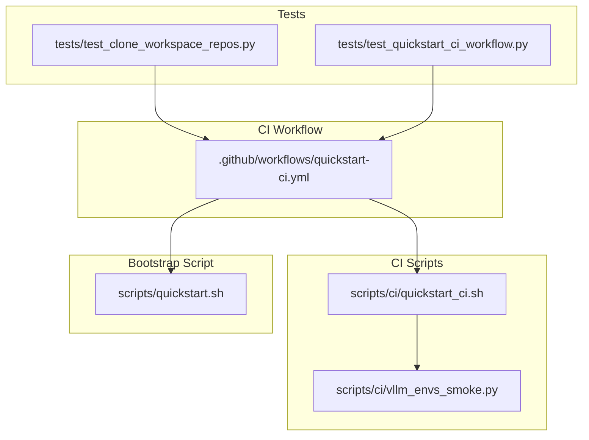
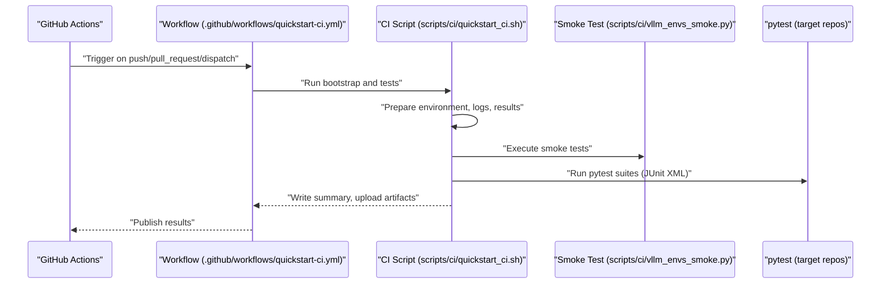
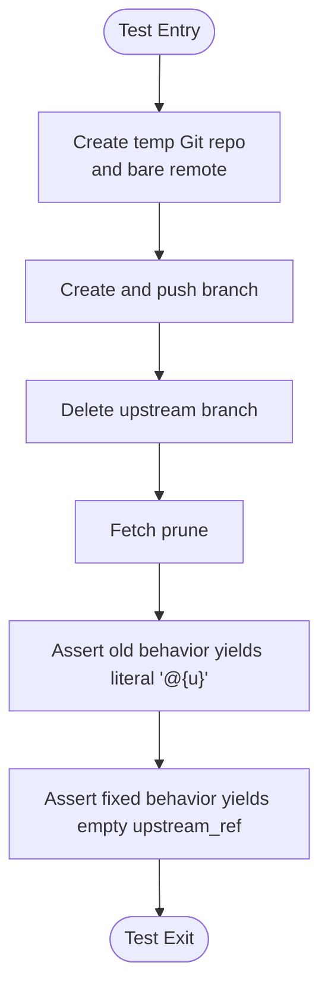
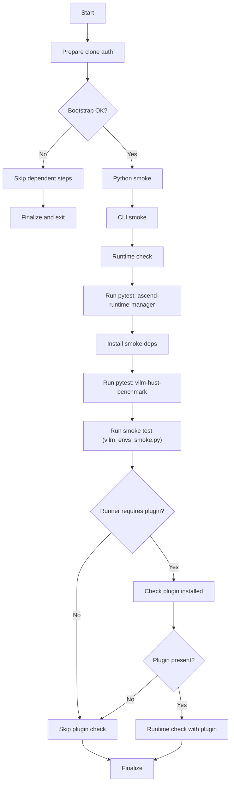
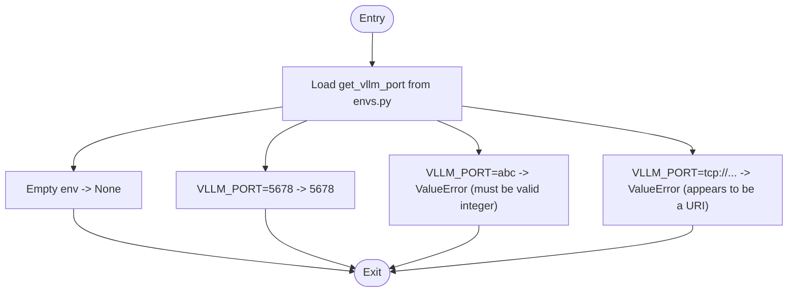
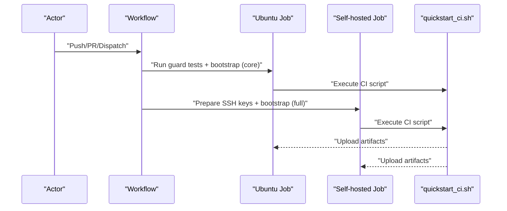
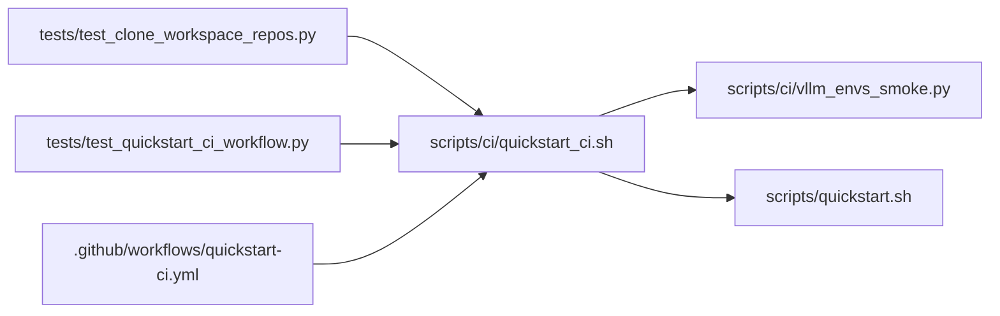

# Testing Infrastructure

<cite>
**Referenced Files in This Document**
- [README.md](file://README.md)
- [.github/workflows/quickstart-ci.yml](file://.github/workflows/quickstart-ci.yml)
- [tests/test_clone_workspace_repos.py](file://tests/test_clone_workspace_repos.py)
- [tests/test_quickstart_ci_workflow.py](file://tests/test_quickstart_ci_workflow.py)
- [scripts/ci/quickstart_ci.sh](file://scripts/ci/quickstart_ci.sh)
- [scripts/ci/vllm_envs_smoke.py](file://scripts/ci/vllm_envs_smoke.py)
- [scripts/quickstart.sh](file://scripts/quickstart.sh)
</cite>

## Table of Contents
1. [Introduction](#introduction)
2. [Project Structure](#project-structure)
3. [Core Components](#core-components)
4. [Architecture Overview](#architecture-overview)
5. [Detailed Component Analysis](#detailed-component-analysis)
6. [Dependency Analysis](#dependency-analysis)
7. [Performance Considerations](#performance-considerations)
8. [Troubleshooting Guide](#troubleshooting-guide)
9. [Conclusion](#conclusion)
10. [Appendices](#appendices)

## Introduction
This document explains the testing infrastructure of the VLLM-HUST Development Hub. It covers the unit testing framework, integration testing approaches, and automated execution via CI/CD. It documents how test scripts are implemented, how results are interpreted, and how to maintain tests effectively. It also describes configuration options, test parameters, and quality assurance processes, and clarifies the relationship with the CI/CD pipeline and continuous testing workflows.

## Project Structure
The testing infrastructure spans:
- Unit tests under the tests/ directory written with Python’s unittest framework
- CI orchestration scripts under scripts/ci/
- A CI workflow definition under .github/workflows/
- A smoke test script under scripts/ci/ for environment validation
- A developer-facing bootstrap script under scripts/quickstart.sh that is also tested indirectly by guard tests

**Diagram sources**
- [tests/test_clone_workspace_repos.py:1-110](file://tests/test_clone_workspace_repos.py#L1-L110)
- [tests/test_quickstart_ci_workflow.py:1-142](file://tests/test_quickstart_ci_workflow.py#L1-L142)
- [scripts/ci/quickstart_ci.sh:1-321](file://scripts/ci/quickstart_ci.sh#L1-L321)
- [scripts/ci/vllm_envs_smoke.py:1-69](file://scripts/ci/vllm_envs_smoke.py#L1-L69)
- [.github/workflows/quickstart-ci.yml:1-149](file://.github/workflows/quickstart-ci.yml#L1-L149)
- [scripts/quickstart.sh:1-800](file://scripts/quickstart.sh#L1-L800)

**Section sources**
- [README.md:1-288](file://README.md#L1-L288)
- [.github/workflows/quickstart-ci.yml:1-149](file://.github/workflows/quickstart-ci.yml#L1-L149)

## Core Components
- Unit tests
  - tests/test_clone_workspace_repos.py validates Git upstream behavior and branch tracking logic by simulating repository setups and asserting shell outputs.
  - tests/test_quickstart_ci_workflow.py guards static contracts between CI scripts and the CI workflow, ensuring that changes to scripts are reflected in the workflow and vice versa.
- CI orchestration
  - scripts/ci/quickstart_ci.sh orchestrates a CI-friendly bootstrap, sets up logging and results, and executes smoke and pytest-based tests across multiple repositories.
  - scripts/ci/vllm_envs_smoke.py is a focused smoke test validating environment import behavior and port configuration parsing.
- CI workflow
  - .github/workflows/quickstart-ci.yml defines jobs for Ubuntu runners and self-hosted runners, invoking the CI script and uploading artifacts.
- Bootstrap script
  - scripts/quickstart.sh is the primary developer bootstrap; guard tests validate key behaviors and CLI options exposed by this script.

**Section sources**
- [tests/test_clone_workspace_repos.py:1-110](file://tests/test_clone_workspace_repos.py#L1-L110)
- [tests/test_quickstart_ci_workflow.py:1-142](file://tests/test_quickstart_ci_workflow.py#L1-L142)
- [scripts/ci/quickstart_ci.sh:1-321](file://scripts/ci/quickstart_ci.sh#L1-L321)
- [scripts/ci/vllm_envs_smoke.py:1-69](file://scripts/ci/vllm_envs_smoke.py#L1-L69)
- [.github/workflows/quickstart-ci.yml:1-149](file://.github/workflows/quickstart-ci.yml#L1-L149)
- [scripts/quickstart.sh:1-800](file://scripts/quickstart.sh#L1-L800)

## Architecture Overview
The testing architecture integrates unit tests, CI orchestration, and CI workflows:

**Diagram sources**
- [.github/workflows/quickstart-ci.yml:24-71](file://.github/workflows/quickstart-ci.yml#L24-L71)
- [.github/workflows/quickstart-ci.yml:86-148](file://.github/workflows/quickstart-ci.yml#L86-L148)
- [scripts/ci/quickstart_ci.sh:161-321](file://scripts/ci/quickstart_ci.sh#L161-L321)
- [scripts/ci/vllm_envs_smoke.py:43-69](file://scripts/ci/vllm_envs_smoke.py#L43-L69)

## Detailed Component Analysis

### Unit Tests: Git Behavior and Quickstart Contracts
- Purpose
  - tests/test_clone_workspace_repos.py simulates repository setups with deleted upstream branches and asserts correct shell behavior around upstream tracking.
  - tests/test_quickstart_ci_workflow.py verifies that changes to scripts are reflected in the CI workflow and that key behaviors (e.g., SSH auth mode, smoke test invocation) remain intact.
- Execution
  - Run with Python’s unittest discovery from the repository root.
  - The workflow step invokes unittest against the tests directory.
- Result interpretation
  - Pass/fail outcomes reflect whether assertions hold for upstream tracking messages and script behaviors.
- Maintenance tips
  - When modifying scripts, update corresponding assertions in the tests.
  - Keep temporary repository creation logic minimal and deterministic.

**Diagram sources**
- [tests/test_clone_workspace_repos.py:33-106](file://tests/test_clone_workspace_repos.py#L33-L106)

**Section sources**
- [tests/test_clone_workspace_repos.py:1-110](file://tests/test_clone_workspace_repos.py#L1-L110)
- [tests/test_quickstart_ci_workflow.py:1-142](file://tests/test_quickstart_ci_workflow.py#L1-L142)
- [.github/workflows/quickstart-ci.yml:31-33](file://.github/workflows/quickstart-ci.yml#L31-L33)

### CI Orchestration Script: quickstart_ci.sh
- Purpose
  - Provides a CI-friendly bootstrap that prepares conda environments, clones repositories, installs dependencies, and runs smoke and pytest-based tests.
- Key behaviors
  - Environment preparation and cleanup
  - Logging per step with standardized result tracking
  - JUnit XML generation for pytest results
  - Conditional plugin checks for Ascend runtime
- Execution
  - Invoked by the CI workflow with environment variables controlling runner flavor, Python version, install scope, and results location.
- Result interpretation
  - Each step appends a line to a TSV results file with name, status, and log path.
  - A Markdown summary is generated and optionally appended to GitHub’s step summary.
- Maintenance tips
  - Add new steps using run_step or run_pytest_step to preserve logging and result tracking.
  - Use skip_step for skipped steps with explicit reasons.

**Diagram sources**
- [scripts/ci/quickstart_ci.sh:232-321](file://scripts/ci/quickstart_ci.sh#L232-L321)

**Section sources**
- [scripts/ci/quickstart_ci.sh:1-321](file://scripts/ci/quickstart_ci.sh#L1-L321)
- [.github/workflows/quickstart-ci.yml:49-71](file://.github/workflows/quickstart-ci.yml#L49-L71)
- [.github/workflows/quickstart-ci.yml:125-148](file://.github/workflows/quickstart-ci.yml#L125-L148)

### Smoke Test: vllm_envs_smoke.py
- Purpose
  - Validates environment import behavior and port configuration parsing for the vLLM environment module.
- Execution
  - Loaded dynamically from the vllm-hust repository and executed via the CI script.
- Result interpretation
  - Assertions validate None when no port is set, exact integer when a valid integer is provided, and ValueError with specific messages for invalid inputs.
- Maintenance tips
  - Keep the module loading robust and isolate environment variables using mocks.

**Diagram sources**
- [scripts/ci/vllm_envs_smoke.py:30-65](file://scripts/ci/vllm_envs_smoke.py#L30-L65)

**Section sources**
- [scripts/ci/vllm_envs_smoke.py:1-69](file://scripts/ci/vllm_envs_smoke.py#L1-L69)
- [scripts/ci/quickstart_ci.sh:208-216](file://scripts/ci/quickstart_ci.sh#L208-L216)

### CI Workflow: quickstart-ci.yml
- Purpose
  - Defines CI jobs for Ubuntu and self-hosted runners, ensuring consistent bootstrap and testing across environments.
- Key behaviors
  - Checks out the repository and runs guard tests before bootstrap.
  - Installs conda if missing and runs the CI script with environment variables.
  - Uploads artifacts containing logs, JUnit XML, and summaries.
- Execution
  - Ubuntu job runs with core install scope; self-hosted job runs with full scope and SSH-based authentication.
- Result interpretation
  - Artifacts include ci-results with structured logs and JUnit XML for test coverage.
- Maintenance tips
  - Keep environment variables synchronized with the CI script’s expectations.
  - Update runner labels and timeouts as infrastructure evolves.

**Diagram sources**
- [.github/workflows/quickstart-ci.yml:14-71](file://.github/workflows/quickstart-ci.yml#L14-L71)
- [.github/workflows/quickstart-ci.yml:73-148](file://.github/workflows/quickstart-ci.yml#L73-L148)

**Section sources**
- [.github/workflows/quickstart-ci.yml:1-149](file://.github/workflows/quickstart-ci.yml#L1-L149)

### Bootstrap Script: quickstart.sh (Integration Context)
- Purpose
  - Provides interactive and non-interactive bootstrap for developers, including repository cloning, conda environment setup, and installation of core and optional packages.
- Integration with tests
  - Guard tests validate key behaviors such as bashrc activation, CLI options, and runtime checks invoked by the CI script.
- Execution
  - The CI script invokes quickstart with flags to clone, create conda environments, and install scoped packages.
- Result interpretation
  - Successful bootstrap enables subsequent CI steps to run pytest and smoke tests.
- Maintenance tips
  - Keep CLI options and environment variable handling consistent with guard tests.

**Section sources**
- [scripts/quickstart.sh:1-800](file://scripts/quickstart.sh#L1-L800)
- [tests/test_quickstart_ci_workflow.py:28-139](file://tests/test_quickstart_ci_workflow.py#L28-L139)

## Dependency Analysis
- Unit tests depend on:
  - Shell commands and Git behavior validated by tests/test_clone_workspace_repos.py
  - Script content and CLI behaviors validated by tests/test_quickstart_ci_workflow.py
- CI orchestration depends on:
  - scripts/ci/quickstart_ci.sh orchestrating conda environments, pytest, and smoke tests
  - scripts/ci/vllm_envs_smoke.py for environment validation
- CI workflow depends on:
  - .github/workflows/quickstart-ci.yml to define jobs, environment variables, and artifact uploads
- Bootstrap script ties together:
  - Developer workflows and CI expectations validated by guard tests

**Diagram sources**
- [tests/test_clone_workspace_repos.py:1-110](file://tests/test_clone_workspace_repos.py#L1-L110)
- [tests/test_quickstart_ci_workflow.py:1-142](file://tests/test_quickstart_ci_workflow.py#L1-L142)
- [scripts/ci/quickstart_ci.sh:1-321](file://scripts/ci/quickstart_ci.sh#L1-L321)
- [scripts/ci/vllm_envs_smoke.py:1-69](file://scripts/ci/vllm_envs_smoke.py#L1-L69)
- [.github/workflows/quickstart-ci.yml:1-149](file://.github/workflows/quickstart-ci.yml#L1-L149)
- [scripts/quickstart.sh:1-800](file://scripts/quickstart.sh#L1-L800)

**Section sources**
- [tests/test_clone_workspace_repos.py:1-110](file://tests/test_clone_workspace_repos.py#L1-L110)
- [tests/test_quickstart_ci_workflow.py:1-142](file://tests/test_quickstart_ci_workflow.py#L1-L142)
- [scripts/ci/quickstart_ci.sh:1-321](file://scripts/ci/quickstart_ci.sh#L1-L321)
- [scripts/ci/vllm_envs_smoke.py:1-69](file://scripts/ci/vllm_envs_smoke.py#L1-L69)
- [.github/workflows/quickstart-ci.yml:1-149](file://.github/workflows/quickstart-ci.yml#L1-L149)
- [scripts/quickstart.sh:1-800](file://scripts/quickstart.sh#L1-L800)

## Performance Considerations
- Parallelism and retries
  - The bootstrap script supports parallel cloning and long-running installs with heartbeat logs to avoid perceived stalls.
- Artifact retention
  - CI artifacts are retained for a limited period to balance storage costs and debugging needs.
- Scope control
  - Install scope (core vs full) allows tuning runtime overhead during CI runs.

[No sources needed since this section provides general guidance]

## Troubleshooting Guide
Common issues and resolutions:
- Test failures in guard tests
  - Verify that changes to scripts are reflected in tests and that assertions remain accurate.
  - Re-run unittest discovery from the repository root to reproduce failures locally.
- CI bootstrap failures
  - Check ci-results logs for the failing step; review environment variables and runner flavor.
  - Confirm conda availability and correct Python version.
- SSH authentication in self-hosted CI
  - Ensure the SSH private key secret is configured and that the workflow prepares the SSH key and known_hosts before running the CI script.
- Smoke test errors
  - Validate environment variable handling and module loading logic in the smoke test script.
- Environment drift
  - Use the CI script’s cleanup and summary mechanisms to isolate test environments and interpret results consistently.

**Section sources**
- [.github/workflows/quickstart-ci.yml:94-108](file://.github/workflows/quickstart-ci.yml#L94-L108)
- [scripts/ci/quickstart_ci.sh:74-99](file://scripts/ci/quickstart_ci.sh#L74-L99)
- [scripts/ci/vllm_envs_smoke.py:43-65](file://scripts/ci/vllm_envs_smoke.py#L43-L65)

## Conclusion
The VLLM-HUST Development Hub employs a layered testing strategy: unit tests validate critical behaviors and contracts, CI orchestration automates reproducible bootstraps and tests, and CI workflows integrate these components into a continuous testing pipeline. By maintaining guard tests, carefully managing environment variables, and leveraging structured logging and artifacts, the project ensures reliable and transparent quality assurance across development and CI environments.

[No sources needed since this section summarizes without analyzing specific files]

## Appendices

### Configuration Options and Parameters
- CI script parameters (via environment variables)
  - RUNNER_FLAVOR: runner classification (e.g., ubuntu, self-hosted)
  - PYTHON_VERSION: Python version for the conda environment
  - INSTALL_SCOPE: core or full install scope
  - RESULTS_ROOT: base path for CI results
  - GITHUB_TOKEN / CI_GITHUB_TOKEN: tokens for authenticated clones
  - HUST_DEV_HUB_GIT_AUTH_MODE: https or ssh for Git authentication
- CI workflow parameters
  - Runner labels and matrix entries
  - Environment variables passed to the CI script
  - Artifact retention settings

**Section sources**
- [scripts/ci/quickstart_ci.sh:10-25](file://scripts/ci/quickstart_ci.sh#L10-L25)
- [.github/workflows/quickstart-ci.yml:50-61](file://.github/workflows/quickstart-ci.yml#L50-L61)
- [.github/workflows/quickstart-ci.yml:125-138](file://.github/workflows/quickstart-ci.yml#L125-L138)

### Best Practices for Test Maintenance
- Keep guard tests close to the behavior they validate
- Use deterministic temporary directories and repository setups
- Prefer run_step and run_pytest_step for consistent logging and result tracking
- Isolate environment variables in smoke tests using mocks
- Align CI workflow environment variables with the CI script’s documented expectations

**Section sources**
- [scripts/ci/quickstart_ci.sh:161-197](file://scripts/ci/quickstart_ci.sh#L161-L197)
- [scripts/ci/vllm_envs_smoke.py:47-65](file://scripts/ci/vllm_envs_smoke.py#L47-L65)
- [tests/test_quickstart_ci_workflow.py:28-139](file://tests/test_quickstart_ci_workflow.py#L28-L139)