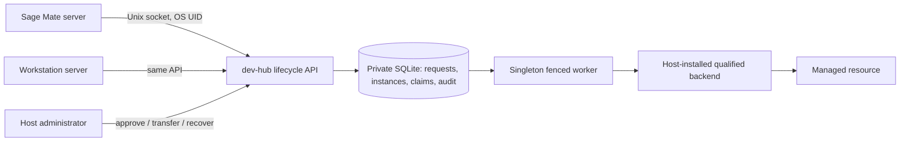

# Unified lifecycle API v1

The dev-hub lifecycle service owns instance allocation, permissions, operations
and recovery. Sage Mate and Workstation are equal thin clients. Neither product
runs `manage.sh`, shell, Docker or systemctl through this API. Existing deployment
`instance-control/v1` remains the separate Mod transaction contract; existing
owner-entry and host-broker protocols are unchanged.

**Delivered boundary:** a working authenticated local service with durable
admission, approval, start/stop, ownership transfer, audit, concurrency and restart
recovery. The shipped executable has an empty backend registry unless explicitly
started with `--simulation`. Simulation persists a separate resource database and
never starts an inference worker. No production systemd/container adapter is
qualified or enrolled. This is a tested control-plane implementation, not a claim
of completed production inference qualification. Existing services remain untouched.

## Architecture and trust



Linux `SO_PEERCRED` supplies the caller UID; a request cannot carry an actor, shell
command, path, environment, image or bearer credential. Profiles are host-owned
policy, mapping an opaque profile ID to backend ID, allowed requester/operator
UIDs and resource keys. Administrative actions require a separately mapped OS
UID. Products may run under distinct service accounts; if they share a UID they
share authority. Browser users are authenticated and authorized by their product
server before it uses its own service principal. Do not label a browser session
as a host administrator or expose the Unix socket to the browser.

The service account owns mode-0700 state, mode-0600 SQLite and immutable host
policy. Put the socket in a service-owned mode-0750 directory and use a dedicated
client group for the mode-0660 socket. Group membership permits connection, not
approval. Host root/service UID is the trusted boundary. Audit is append-only
through this API, not tamper-proof against root; forward host logs/backups to your
existing retention system if that stronger boundary is required.

SQLite `BEGIN IMMEDIATE` and FULL synchronous writes atomically bind actor +
idempotency key + exact body to a response, reserve resources, advance generation,
and record audit. A nonblocking OS file lock excludes concurrent workers across
processes. Effects do not hold a database transaction, so clients can observe
pending work. Each execution or recovery obtains a higher fence. There is no
lease-timeout takeover: the OS lock must first be available, and a qualified
backend must exclude all old or external lifecycle writers. Same-store enrollment
in the old deployment controller is rejected in both directions; separate stores
are **not** a substitute for one host-wide authority and external writer fencing.

A single worker serializes effects across all instances in v1, trading throughput
for a small recovery surface. Backends must be synchronous and bounded. Slow NPU
startup requires a qualified supervisor contract; a blocking `systemctl start`
with recursive owner entry or a queued Docker command does not meet this contract.
The existing host broker remains a separate execution plane until such an adapter
is qualified. There is no fallback to the old scripts.

## State machine

| State | Action / result |
|---|---|
| `requested` | Eligible caller requested a host profile; nothing runs or is claimed yet. |
| `stopped` | Admin approved; resources claimed atomically and stopped baseline verified. |
| `rejected` | Admin rejected the request; terminal allocation record. |
| `starting` / `stopping` | Generation advanced and operation persisted before the effect. |
| `running` / `stopped` | Backend verification committed; generation advances again. |
| `recovering` | Admin resubmitted the retained rollback after a recovery failure. |
| `recovery_required` | Restore/ownership verification failed; claims remain held, further start/stop blocked. |

Operations move `queued -> applying -> committed`, or
`applying -> rolling_back -> rolled_back/recovery_required`. A worker encountering
an interrupted `applying`/`rolling_back` operation restores **only its original
baseline**. An untouched baseline needs no restart. Unknown or foreign identity
causes recovery-required without touching the foreign resource. A closed gate
rejects new operations; previously queued operations restore their baseline and
recovery remains available. Gate changes require service restart; hot policy
reload is not provided.

`transfer` is atomic reassignment of an **already managed** idle instance to an
eligible owner, with generation CAS and a higher fence. It does not restart it.
Old owners lose status/replay access unless independently allowed as operators.
There is no external live-instance adoption endpoint. Approval rejects a running
baseline. Resource claims are conservative: stopped instances retain claims;
resource release, deletion, GC and automatic restart of an unexpectedly dead
serving worker are intentionally outside v1. Retain state and diagnose drift.

## Wire API

One UTF-8 JSON request (at most 4096 bytes) per Unix stream connection. Send EOF
on the write side, then read one JSON reply until EOF. The request always includes
`"schema":"vllm-hust.lifecycle/v1"` and `action`. Unknown/duplicate fields and JSON
keys are rejected. No HTTP listener is installed. At most 16 clients are served
concurrently, with a two-second total request-body deadline.

| Action | Additional fields | Permission |
|---|---|---|
| `list` | none | Filters to visible instances |
| `request` | `instance_id`, `profile_id`, `request_id` | Profile requester/admin |
| `approve`, `reject` | `instance_id`, `expected_generation`, `request_id` | Admin |
| `start`, `stop` | same as approve | Owner/profile operator/admin |
| `transfer` | same, plus `new_owner_uid` | Admin, eligible new owner |
| `recover` | same as approve | Admin, only recovery-required |
| `status` | `instance_id` | Owner/operator/admin |
| `operation` | `operation_id` | Current instance owner/operator/admin |
| `audit` | `instance_id`, `after_sequence` | Same; at most 100 events/page |

Identifiers match `[a-z][a-z0-9-]{0,63}`. Generations, UIDs and audit cursors are
nonnegative integers, not booleans. Every mutation needs a unique `request_id`
within the caller UID's lifetime keyspace. Exact replay returns the original
admission response even after completion or a gate closure; poll `operation` for
current completion. Reusing a key with a different body returns
`idempotency_conflict`. A disconnect does not cancel admitted work. A new key with
a stale generation returns `generation_conflict`; refresh status and get a new
user decision before submitting a different action. Do not silently overwrite
another product's newer intent. Repeated start of a verified running instance
(or stop of stopped) is a durable no-op operation, not a restart.

Success replies contain `ok:true`, `protocol` and the result. Failure replies have
`ok:false`, `protocol`, and a credential-free `error` code. Important codes:
`forbidden`, `administrator_required`, `new_operations_disabled`,
`generation_conflict`, `operation_conflict`, `resource_conflict`,
`backend_not_qualified`, `runtime_identity_drift`, `policy_changed` and
`authority_busy_or_unavailable`. Retry busy/transport failures with bounded
backoff and **the same exact request**. Rejected requests can be retried because
no admission key was consumed. Never retry denied permission through a shell.

`status.instance.state` is durable control state. `instance.observation` and
`observed_at` are last committed evidence. Separate `observed` / `observed_at` /
`drift` fields report the current backend read. `backend_available=false` or
`observed=null` means unavailable evidence, not a stopped or healthy worker.
Simulation always reports `evidence=simulation`; it is not live inference evidence.

## Product integration

Both products use the same server-side Python client (pin dev-hub to a commit):

```python
import uuid
from instance_control.lifecycle import PROTOCOL
from instance_control.lifecycle_client import call

SOCKET = "/run/vllm-hust-lifecycle/api.sock"

def read_instance(instance_id):
    return call(SOCKET, {"schema": PROTOCOL, "action": "status",
                         "instance_id": instance_id})

def start_instance(instance_id, displayed_generation):
    request = {"schema": PROTOCOL, "action": "start",
               "instance_id": instance_id,
               "expected_generation": displayed_generation,
               "request_id": "ui-" + uuid.uuid4().hex}
    # Persist this exact request before sending; reuse it after a timeout.
    result = call(SOCKET, request)
    return result["operation_id"]
```

Sage Mate: render the returned control state, fresh observation and operation;
submit start/stop from its authenticated server action. Keep Responses proxy
compatibility work independent. Workstation: use the identical calls for runtime
controls; route allocation approval, rejection, ownership transfer and recovery
through a separately authenticated host-admin process. Neither product receives
an execution grant, shell command or backend state directory. Do not implement
another state machine in either UI. For non-Python servers use the same bounded
JSON-over-Unix-stream framing and EOF semantics.

## Operations and validation

The checked-in config is disabled with no profiles. The systemd file is an
**uninstalled template**: review account/group IDs, install pinned code under
`/opt/vllm-hust-dev-hub`, provide service-readable private config at
`/etc/vllm-hust/lifecycle.json`, and create the dedicated accounts before using it.
`StateDirectory` / `RuntimeDirectory` create the private directories. The template
runs no production backend and has no simulation flag. Starting this API alone
cannot take over a service. This change did not install or start that unit.

For a completely isolated simulation, create a mode-0700 temporary directory and
a mode-0600 config based on the example with:

- state/socket paths inside that directory;
- your current UID in `administrator_uids`, `requester_uids`, `operator_uids`;
- `enabled:true`, `socket_gid:null`;
- one profile, e.g. `cpu`, containing `backend_id:"simulation"`, the UID lists,
  and `resources:["simulation:cpu-slot"]`.

Then run `python3 scripts/instance_lifecycle.py --config /absolute/config.json
--simulation` in the foreground. Use request -> admin approve -> start -> poll ->
stop. SIGTERM stops only the API; simulation state remains in its private DB.
The automated subprocess integration test performs this setup and verifies
restart with a stale socket. It does not invoke a production lifecycle command.

Run `python3 -m unittest discover -s tests -p 'test_instance_lifecycle.py' -v` and
the existing instance-control, host-authority and broker suites. Tests inject
process death at reservation, effect, rollback intent, restored effect and final
commit; they cover concurrent conflicting requests and same-key retries, failed
restoration, policy drift, foreign occupants, atomic resource claims and transfer,
OS peer framing, restart persistence and exception redaction.

Before enabling a real target, implement the `LifecycleBackend` contract in
trusted host code and prove its immutable launch snapshot, exact identity checks,
resource fencing across all Docker/systemd/legacy writers, bounded effects and
operation-scoped restoration using isolated instances first. Review backup and
restore together with the external resource state: restoring an old SQLite file
alone can roll back fences and must not authorize work. Do not edit operation
rows, delete lock files on a live service, or reset a recovery-required record.
Use admin `recover` after correcting the cause; if its pinned policy changed,
restore the approved policy first. No target-specific NPU rollout has been done.
